# Apigee API Jam Lab Guide

Welcome to Apigee API Jam workshop. This hands-on workshop takes into account the experience of hundreds of customers who have used Apigee Edge to implement a successful API program. By the end of this workshop, you will walk away with practical experience using the Apigee Edge platform, along with an understanding of its comprehensive capabilities.

## Pre-requisites

* **Apigee Account** - If you don’t have an account, sign-up for a trial account at [https://login.apigee.com/sign__up](https://login.apigee.com/sign__up)  We will notify you on the registered email, once the account is created. This could take a few minutes. .

* **REST Client** - cUrl or Postman 

## Lab 1: Import a proxy

### Summary

In this lab, we will import a pre-built API proxy bundle into the Apigee Edge platform. 

### API Proxy Bundle

An API Proxy Bundle is a collection of API Proxy artifacts and policies that represent the configuration of such API Proxy. [https://docs.apigee.com/api-services/content/build-simple-api-proxy](https://docs.apigee.com/api-services/content/build-simple-api-proxy) 

#### Instructions

1. Download the Proxy bundle from the [I Love APIs API Jam repository](https://github.com/sudheesreedhara/Iloveapis-apijam/blob/master/Resources/beers_apiproxy_bundle.zip). Click **Download**.

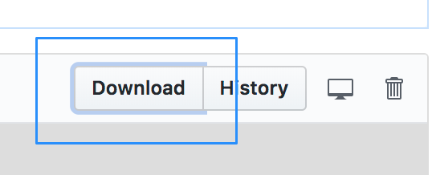

2. Go to [https://apigee.com/edge](https://apigee.com/edge) and log in to your new Apigee trial organization. Under your username, select the Organization for which you are an "Organization Administrator"

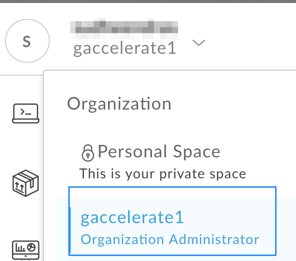

3. Navigate the **Develop → API Proxies** on the left side menu, click **+ Proxy** in the top right corner to invoke the Create Proxy Wizard. Then select **Proxy Bundle**, and click next. 
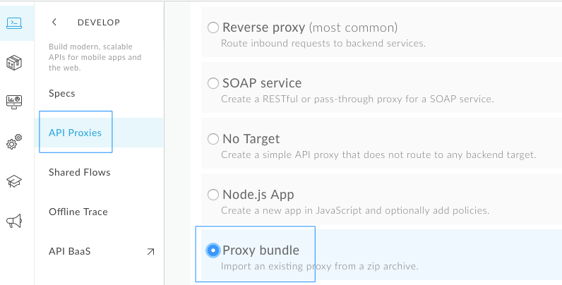

4. You will need to click on the **Choose File** button next to the **ZIP Bundle **option and select the **beers_apiproxy_bundle.zip** from the Github repository you downloaded above. Enter the following details in the proxy wizard and click **Next**, then **Build.**

    * Proxy Name : **Beers**

5. Click on the link to view your API proxy in Proxy Editor. Then click the **Deployment **dropdown, select the **test** environment, then **Deploy** from the **Overview** tab. 
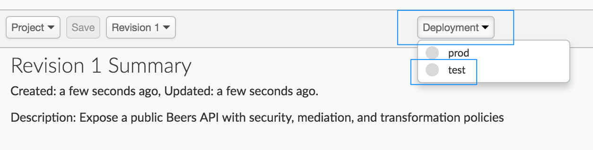

6. Once your API is deployed successfully, select **Develop** in the right side tab bar menu and the API Proxy configuration view is displayed.

## Lab 2: Explore policies

### Summary

In this lab, we will explore the various API proxy policies that can be configured in Apigee. 

### Spike Arrest Policy

The Spike Arrest policy protects against traffic spikes. It throttles the number of requests processed by an API proxy and sent to a backend, protecting against performance lags and downtime. [https://docs.apigee.com/api-services/reference/spike-arrest-policy](https://docs.apigee.com/api-services/reference/spike-arrest-policy) 

**Instructions:**

**2.1**  Navigate to the **Target Endpoints **default** Preflow **and highlight the **Spike Arrest **policy. The default **Spike Arrest** rate in the API Proxy is 10pm.

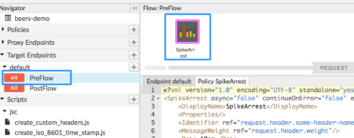

**2.2**    Select **Trace ** in the right side tab bar menu and the API Proxy configuration view is displayed and select **Start Trace Session. **

** 2.3**   Select **Overview** in the right side tab bar menu and select the **Deployments URL. **A new browser window will open and your will see a default HTTP 404 message. Add a forward slash and number I.E. **/1 **to the URL in your browser to return sample beer data. 

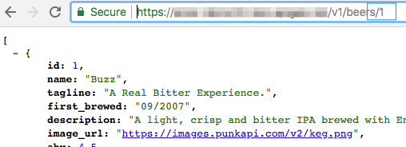

*curl https://{***_FQDN_***}/v1/beers/1*

Refresh your browser a few times to trigger the **Spike Arrest **policy. 

Navigate back to the **Trace **right side tab bar menu, click on the **Spike Arrest** policy icon in the **Transaction Map** to view the flow details in the **Phase Details** section below.** **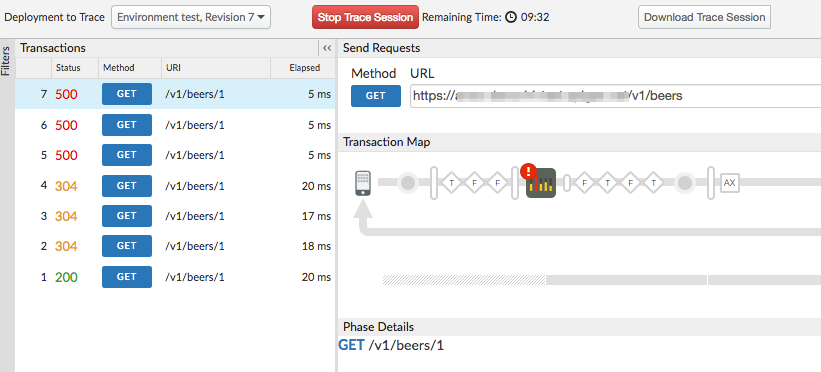

### Verify API Key Policy

The Verify API Key policy lets you enforce verification of API keys at runtime, letting only apps with approved API keys access your APIs. This policy ensures that API keys are valid, have not been revoked, and are approved to consume the specific resources associated with your API products. [https://docs.apigee.com/api-services/reference/verify-api-key-policy](https://docs.apigee.com/api-services/reference/verify-api-key-policy) 

**Instructions:**

**2.4 **Navigate to the **Proxy Endpoints **default** Preflow **and highlight the **Verify API Key **policy. Change the ‘enabled=**false’** to ‘enabled=**true’**, then click the blue **Save** button.

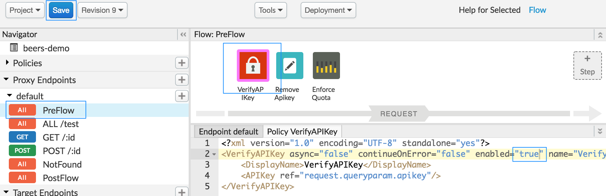

**2.5** Select **Trace** in the right side tab bar menu and the API Proxy configuration view is displayed and select **Start Trace Session. **

**2.6** Refresh your browser a few times to trigger the **Verify API Key **policy. You should receive a HTTP 401 error. 

*curl https://{***_FQDN_***}/v1/beers/1*

## Lab 3: Management APIs

### Summary

In this lab, we will see how to use the Apigee management APIs to automate the promotion of API from a lower environment (test) to a higher environment (prod).

**3.1:** Get OAuth credentials to access management APIs. 

*curl -H "Content-Type:application/x-www-form-urlencoded;charset=utf-8" -H "Accept: application/json;charset=utf-8" -H "Authorization: Basic **ZWRnZWNsaTplZGdlY2xpc2VjcmV0**"  -X POST https://login.apigee.com/oauth/token -d 'username={YOUR EMAIL}&password={YOUR_PASSWORD}&grant_type=password'*

**NOTE** : Use "*Basic ZWRnZWNsaTplZGdlY2xpc2VjcmV0*" value exactly as shown here. It is a hard-coded value that the API requires in the Authorization header.

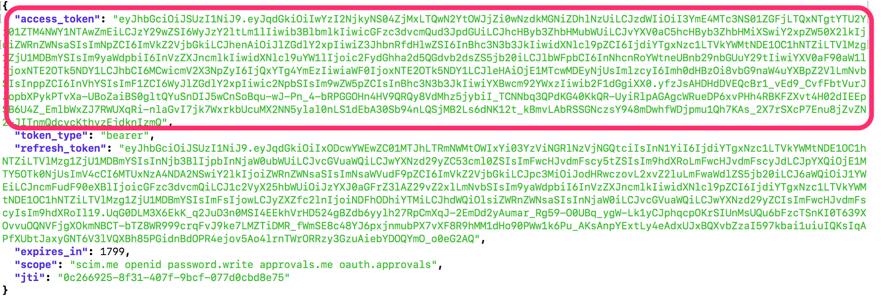

The response should look like this. Copy the first token which starts with access_token Copy the value starting with "ey…..". Do not copy the “”.

We will need the** access_tokens** to make all subsequent calls.

**3.2. **Use the management APIs to promote the proxy deployed in test to prod environment. *Execution time will be a minute or two*

*curl -X POST -H "Content-type:application/x-www-form-urlencoded" https://api.enterprise.apigee.com/v1/o/{***_Your-org-Name_***}/e/prod/apis/{***_Your-proxy-name_***}/revisions/1/deployments*

*-H "Authorization: Bearer {***Access_token here***}"*

You should see a response which looks like this: 

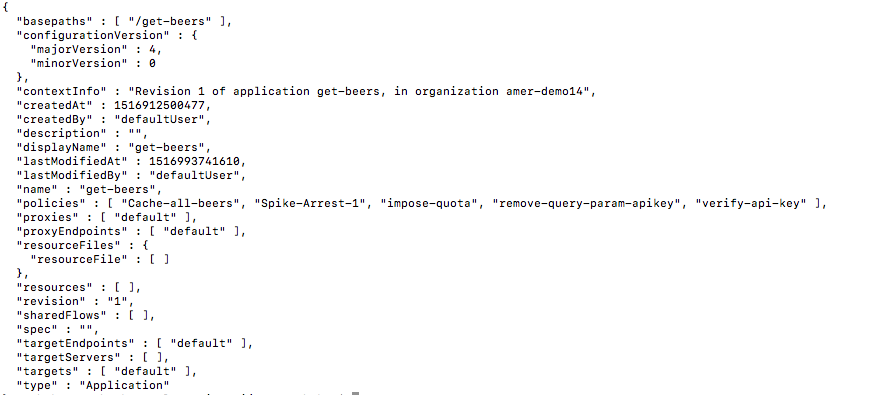

Now if you go back to the Edge UI, you will notice that your Beer proxy is deployed on both test and prod environments. 

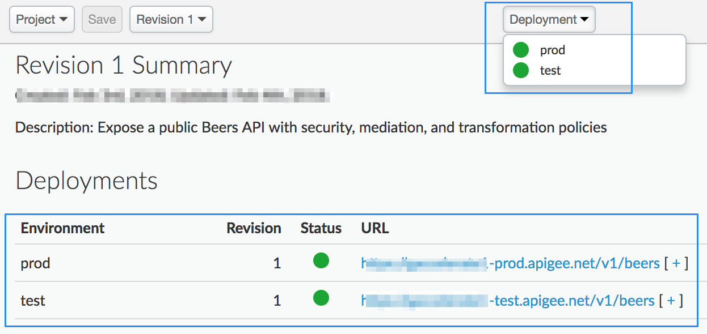

## Lab 4: Publishing the APIs

### Summary

We are going to package our Proxy into a Product, then grant access for an Application to access that Product 

### Define a Product

A Product is a logical grouping of Proxies.  In this section we will create a **BeerCatalog** Product that contains our Proxy.

#### Instructions

1. Navigate to **Publish -> API Products****.**

2. Click **+API Product** in the upper right

	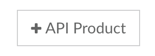

3. Name the product **BeerCatalog**.  Set the Environment to **test**, Access to **Public**, and Key Approval to **Automatic**.  Using the **+API Proxy** on the lower right, choose the **Beers **proxy from the dropdown list.  Click **Save**.

	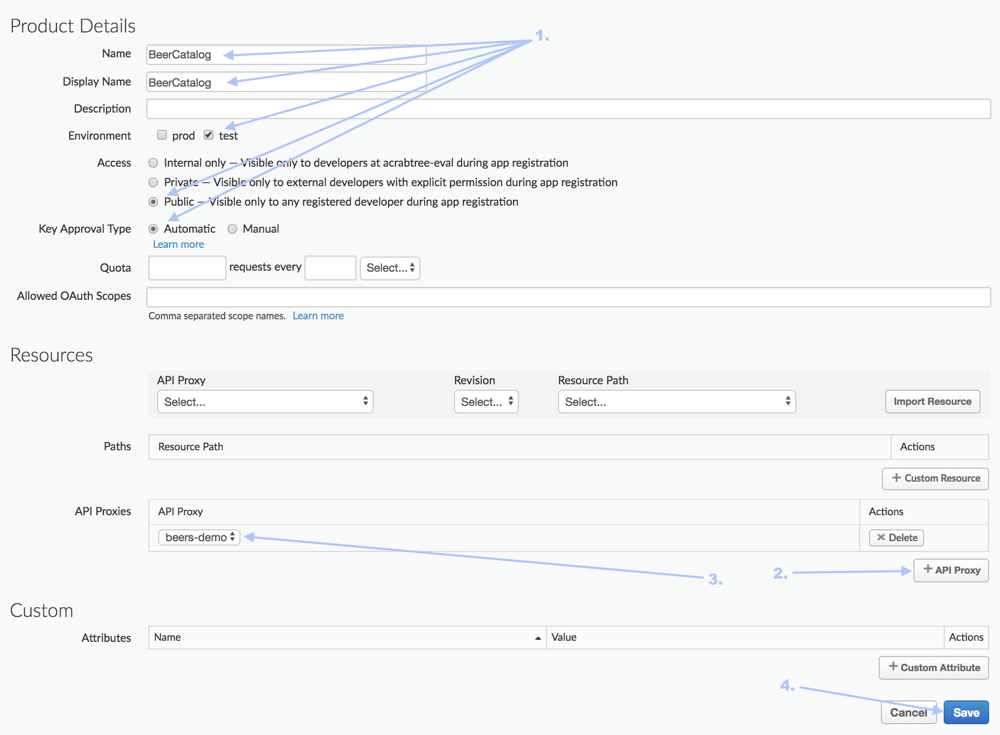

### Define a Developer

A Developer owns an Application, so we need to create a Developer next.

#### Instructions

1. Navigate to **Publish -> Developers**

2. Click **+Developer** in the upper right corner.

	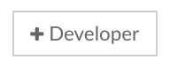

3. Fill in your information.  Click **Create**.

### Define an Application

We grant an Application access to a Product.  We will now define an Application to use our Product.

#### Instructions

1. Navigate to **Publish -> Apps.**

2. Click **+App** in the upper right corner.

	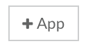

3. Name the application **DistributorApp**, choose the **Developer** you created earlier, click the **+Product** and choose the **BeerCatalog**, then click **Save**.

	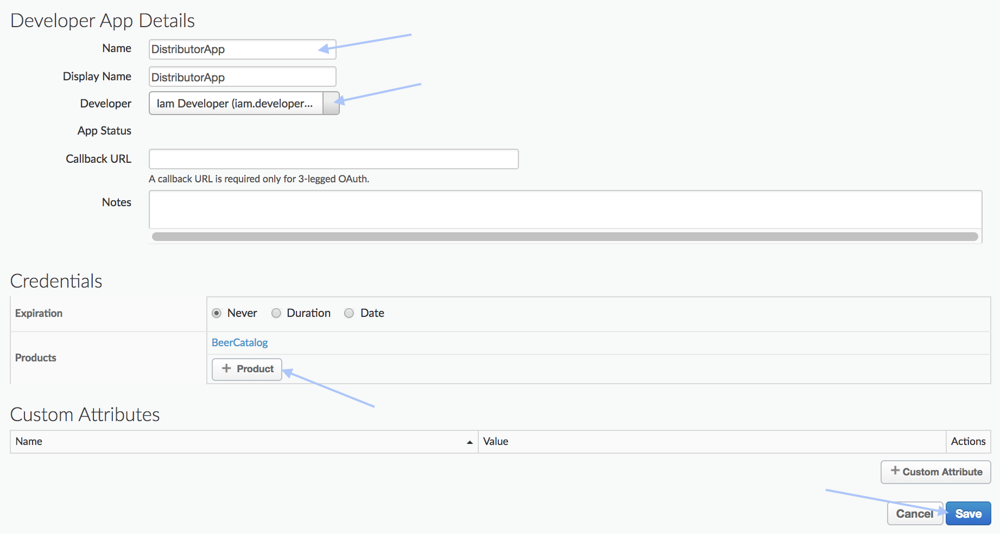

4. Choose the **DistributorApp** from the application list.  Click the **Show** button underneath the **Consumer Key** section and copy the key shown.

	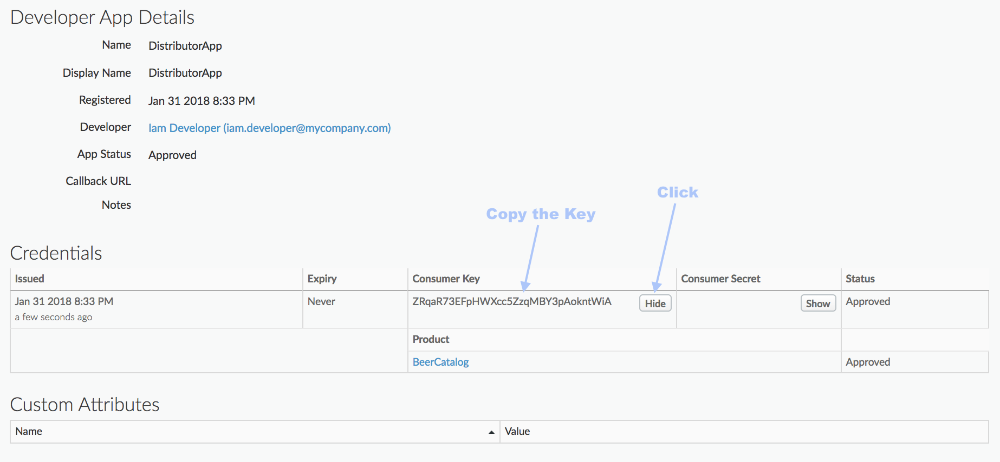

### Test Your Proxy

Now that we have an API Key (the Consumer Key), we can test our proxy.

#### Instructions

1. Navigate to **Develop -> API Proxies** and choose your proxy.

2. Choose the **Trace** tab.

3. Select **Environment test **in the Deployment to Trace dropdown.

4. Click **Start Trace Session**, then add **?apikey=<the key you copied>** to the URL and click **Send**.

	E.g.  *https://{***_FQDN_***}/v1/beers/1***?apikey=<the key you copied>**

## Lab 5: Publish APIs to Developer Portal

### Summary

In this lab, we will create & customize a developer portal and publish the Beer API onto the portal. 

#### Instructions

### Update Product configuration

1. Navigate to **Publish → API Products**

2. Select the **BeerCatalog **product you created in the previous lab.

3. Click on **Edit** and replace the value in **Description **field with the content from [here](https://raw.githubusercontent.com/sudheesreedhara/Iloveapis-apijam/master/Resources/product-snippet.html). 

4. Click on **Save**.

### Import OpenAPI Spec

1. Navigate to **Develop → Specs. **

2. Click **+ Spec and **select **Import URL**

    1. Import Name - ** Beer-Spec**

    2. Import Url - [https://raw.githubusercontent.com/sudheesreedhara/Iloveapis-apijam/master/Resources/Beers-Spec.yaml](https://raw.githubusercontent.com/sudheesreedhara/Iloveapis-apijam/master/Resources/Beers-Spec.yaml) 

3. Select the newly imported **Beer-Spec**. 

4. Replace **<your-apigee-org-name>** in **host** attribute with your Apigee Org name. After you update, the value of host should look like this. 

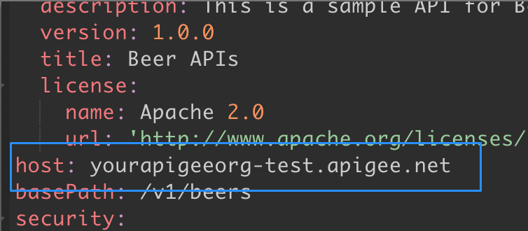

5. Click **Save**.

### Create the Developer portal

1. Navigate to **Publish → Portals**

2. Click on **+ Portals **to create a new portal. 

    1. Name - BeerPortal

    2. Description - My Beer Portal

3. Click **Create.**

### Customize the Developer portal

1. Download the** logo.png** file from [here](https://github.com/sudheesreedhara/Iloveapis-apijam/blob/master/Resources/logo.png). 

2. Download **portal-hero.jpg** file from [here](https://github.com/sudheesreedhara/Iloveapis-apijam/blob/master/Resources/portal-hero.jpg). We will use these files in the subsequent steps.

3. Click on the name of the newly created portal.

	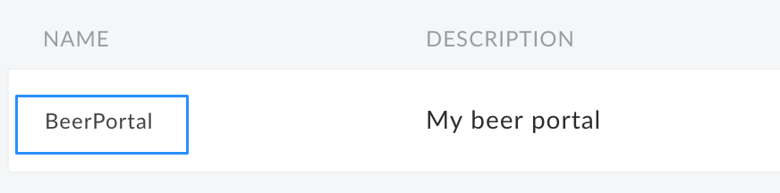

4. Click **Assets**

5. Click **+ File **and upload the **logo.png **and **portal-hero.jpg **files.

6. Select **Themes** from the drop-down at the top.

	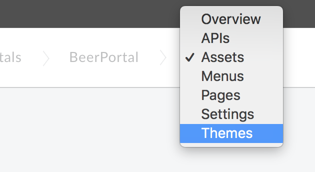

7. Replace the default style-sheet with [this content](https://raw.githubusercontent.com/sudheesreedhara/Iloveapis-apijam/master/Resources/theme.css).

	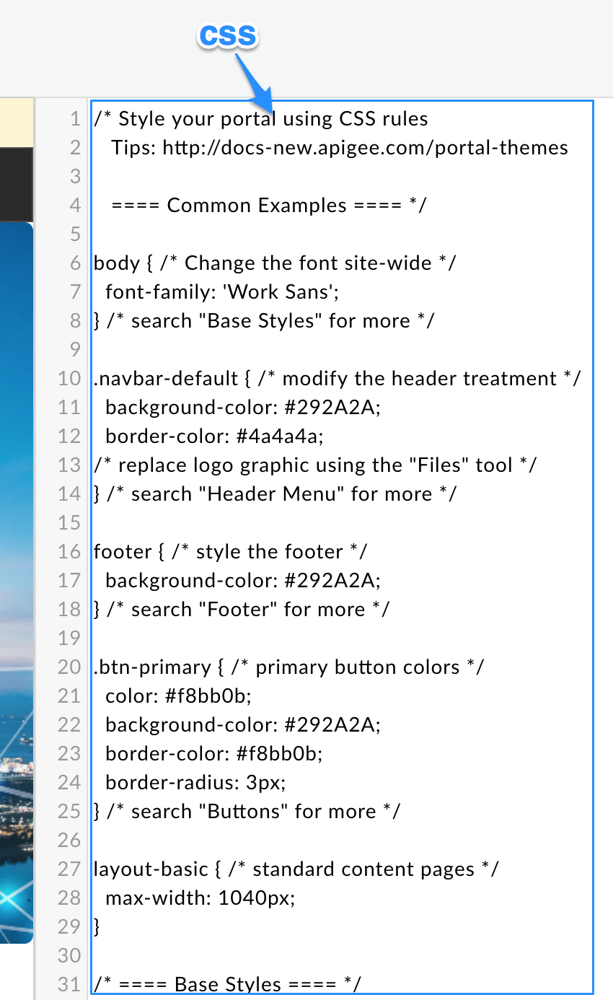

8. Click **Publish **to save the changes.

9. Select **Pages** from the drop-down at the top.

	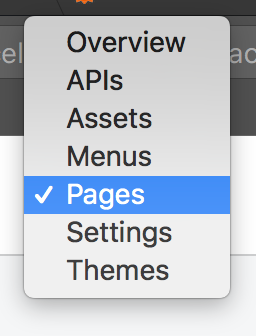

10. Select **Home** page and replace the content with this [snippet](https://raw.githubusercontent.com/sudheesreedhara/Iloveapis-apijam/master/Resources/homepage.html). 

11. Click **Publish **to save the changes.

**	**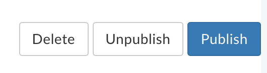

12. Click **Live Portal **to view the customized portal.  

	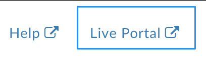

13. You should see a portal similar to this - 

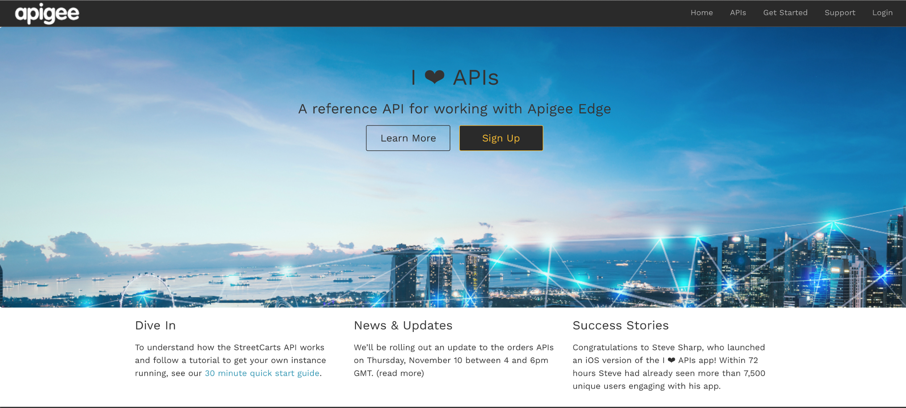

### Publish Documentation to the portal

1. Navigate to **Publish → Portals**

2. Click on your portal and select **APIs.**

3. Click **+ API**

4. Select **BeerCatalog **product and click **Next**.

5. On the next screen,  select  "**Choose a different spec**" from the drop-down.

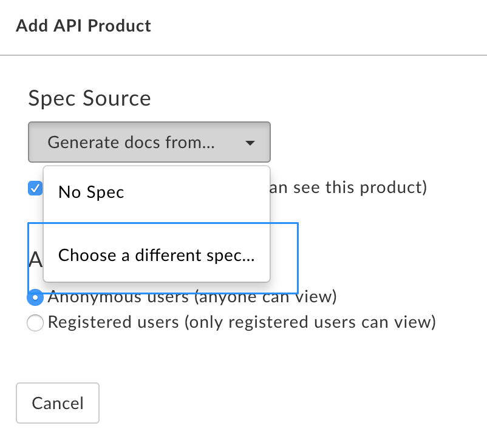

6. Select **Beer-Spec **and** **click **Finish **to publish the API Product and it’s documentation on to the portal**.** 

**	**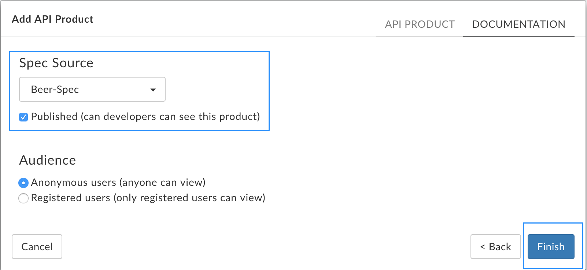

7. Now if you go to the **Live Portal, **you will see Beer API documentation under APIs menu.

	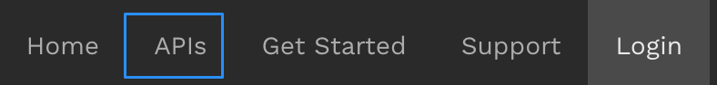

8. Click on the API Doc link.

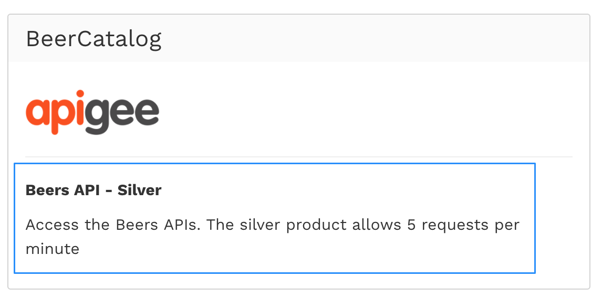

9. Click **Try it out **and invoke the Beer API by providing a valid API key (Hint - Use the API key from **DistributorApp **you created in the previous lab).

	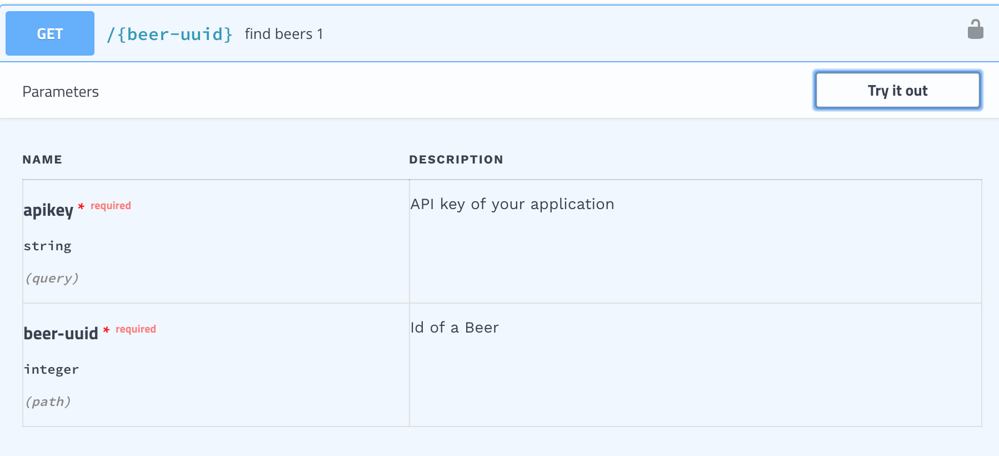

## Lab 6: Analytics

### Summary

We are going to generate load against the Beer Proxy and then analyze the resulting traffic in a Custom Report.

### Generate Load

The first step is to create some traffic that invokes an HTTP GET on random beer id’s on the Beer Proxy (e.g. "/v1/beers/1" or “/v1/beers/4”).  You can use Apigee’s Javascript policy to do this as we’ll see below.

#### Instructions

1. Navigate to **Develop -> API Proxies**

2. Select the **Beers** proxy.

3. Click on **Develop** in the upper right.

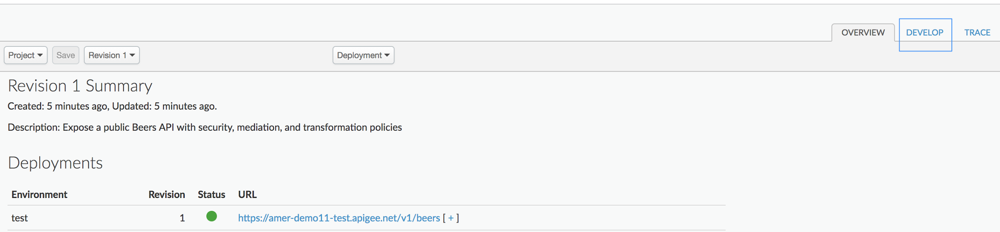

4. Select **PreFlow** under the **loadgenerator** Proxy Endpoint in the lower left column/pane.  

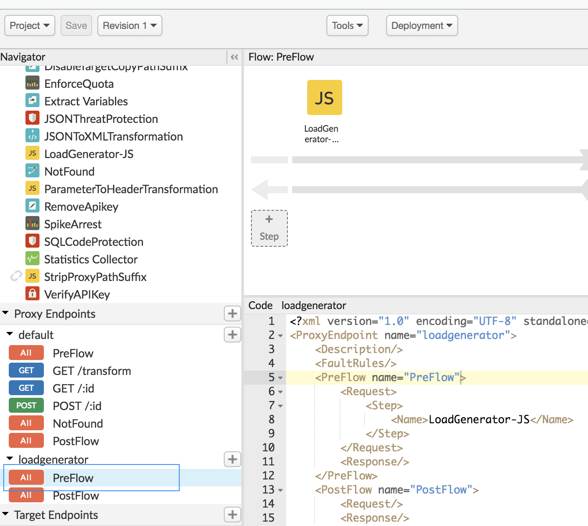

5. Notice the yellow JavaScript (JS) policy named **LoadGenerator-JS** has already been created for you.  When you select it, you will see its XML configuration and you should notice that it runs some JavaScript code in a file named **load_generator.js**.

6. Click on **load_generator.js** on the bottom left area of the screen.  This is the JavaScript code we wrote to generate some random traffic against the Beer Proxy.  You could always modify this code to create load as you’d like, but for this Lab just leave it as is.

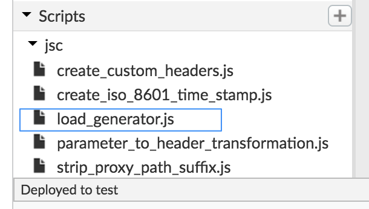

7. Before we generate the random load, we need to disable the Spike Arrest Policy that we saw earlier.  Select **PreFlow** under **TargetEndpoints** in the left column/pane.  Then Select the **Spike Arrest** Policy in the upper right pane.  Modify the XML for the Spike Arrest policy so **enabled="false”**.  Click **Save** in the upper left  when done.

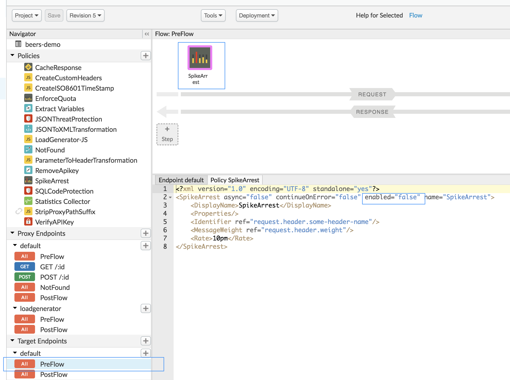

8. We will also need to disable the **Verify API Key Policy**.  Select **PreFlow** under **ProxyEndpoints** and select the **Verify API Key Policy**.  Then change **enabled="true”** to **enabled=”false”** and click **Save.**

9. Now click on the **Trace** tab in the upper right of the screen.  If necessary, modify the URL after the hostname to be  **/v1/loadgenerator**.  Then click on **Start Trace Session**, and finally click on **Send** to generate some load against the Beer Proxy.  In the left column/pane, you can see several HTTP GET calls are made for randomly chosen beer id’s.

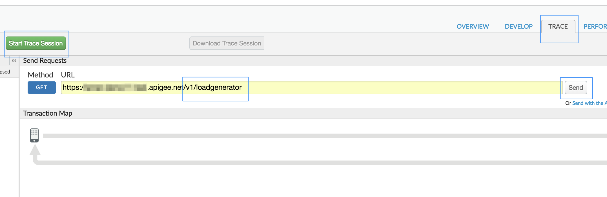

### Capture Statistics for Custom Reports

After you’ve generated some traffic, let’s make sure we are capturing the right data from that traffic so we can analyze it via Custom Reports. 

1.  Click on the **Develop** tab in the upper right.  Then click on **GET /:id **under **Proxy Endpoints**.  In the upper pane, you will see the two policies **Statistics Collector** and **Extract Variables** that we’ve already implemented for you in order to capture the "Beer Name" from the JSON response payload.  Take a look at these two policies but don’t change them -- they are used for creating Custom Reports (next step).

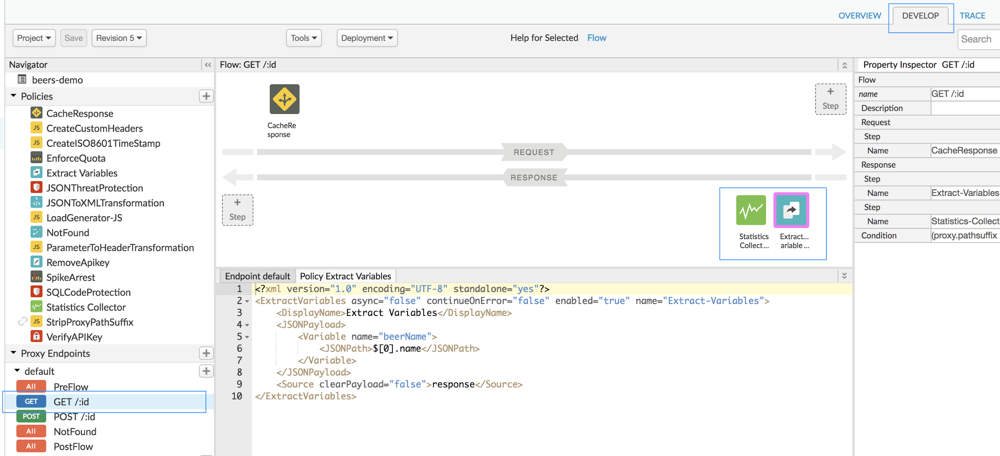

1.   Now click on **Analyze ****-****> Reports **in the left pane.  Then click on **+Custom Report**

1. Fill in the **Report Name**, **Report Description**, and choose **Column** as the **Chart Type**.  Then select **Traffic** in the **Metric** dropdown and choose **Sum** for **Aggregate Function**.  Finally, choose **beer_name** in the **Dimension** dropdown and click **Save** in the lower right.

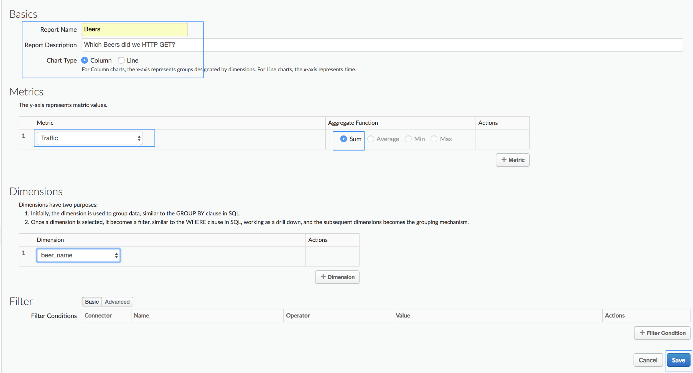

2. You should see a report similar to what is shown below.  Please note that it takes 5-10 minutes for API proxy requests to appear in these reports, so your report may need to be refreshed to capture the latest data.  Which beers were the most popular?

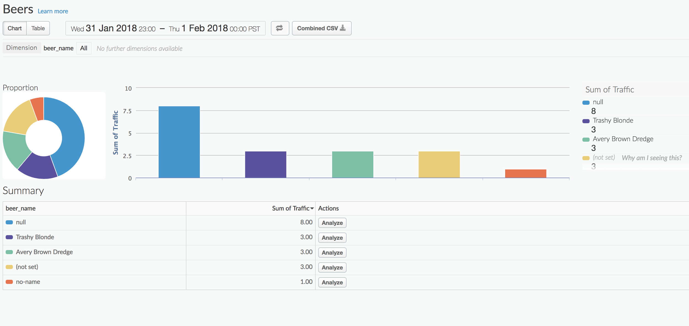

## Summary

This concludes the API Jam workshop. We hope you enjoyed the hands-on session. 

## References

Apigee Community
[https://community.apigee.com/index.html](https://community.apigee.com/index.html) 

Apigee Documentation
[https://docs.apigee.com/](https://docs.apigee.com/) 

Apigee Developer Videos
 [https://apigee.com/about/developers](https://apigee.com/about/developers) 

Apigee Edge management APIs [https://docs.apigee.com/api-services/content/api-reference-getting-started](https://docs.apigee.com/api-services/content/api-reference-getting-started) 

### License
All of the material here is released under the Apache 2.0 license

